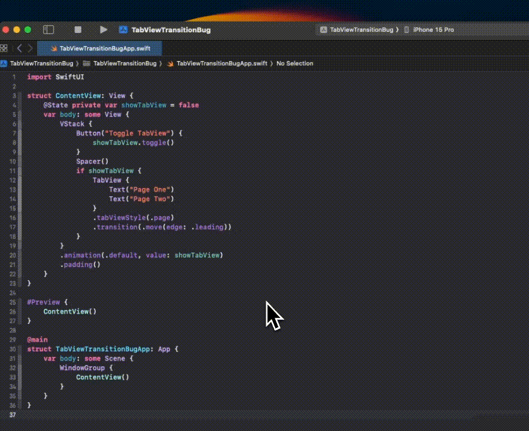

# SwiftUI TabView Bug

This repository demonstrates a SwiftUI [`TabView`](https://developer.apple.com/documentation/swiftui/tabview) bug when used with [`.tabViewStyle(.page)`](https://developer.apple.com/documentation/swiftui/tabviewstyle/page) and any animated `.transition()` that moves the view horizontally (e.g. [`.move(edge: .leading/.trailing))`](https://developer.apple.com/documentation/swiftui/anytransition/move(edge:)), [`.slide`](https://developer.apple.com/documentation/swiftui/anytransition/slide), [`.offset()`](https://developer.apple.com/documentation/swiftui/anytransition/offset(x:y:)), etc.) in landscape orientation.

When the tab view transitions in, the content appears off-center and the animation goes back and forth before it stabilizes.



The code to replicate this:

```swift
import SwiftUI

struct ContentView: View {
    @State private var showTabView = false
    var body: some View {
        VStack {
            Button("Toggle TabView") {
                showTabView.toggle()
            }
            Spacer()
            if showTabView {
                TabView {
                    Text("Page One")
                    Text("Page Two")
                }
                .tabViewStyle(.page)
                .transition(.slide)
            }
        }
        .animation(.default, value: showTabView)
    }
}

#Preview {
    ContentView()
}

@main
struct TabViewTransitionBugApp: App {
    var body: some Scene {
        WindowGroup {
            ContentView()
        }
    }
}
```

Tested on Xcode 15.3 (15E204a), iOS 17.3.1 iPhone, iOS 17.4 Simulator.
